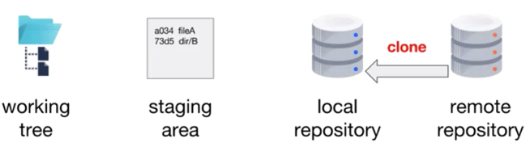

## DevOps and Git in a Nutshell
* Continuous improvement – commits
* Simultaneous stability and development – branches
* Improved quality – pull requests

## Git Overview
* Version control enables teams to manage a collection of files in an agile way
* Git is a distributed version control system
  * Each user has a local copy of a Git repository
* A repository contains the project history as commits
  * A commit is a snapshot of the entire project
* You have the choice of working with Git using a command line and/or a graphical interface

## Sourcetree Installation and Getting Started
* Source tree can be installed on Mac or Windows at 
[this link](https://www.sourcetree.app.com/)
* Other Git clients can be found at 
[here](https://git-scm.com/downloads/guis)

## Git Locations

* The **working tree** contains the project files for a single commit
* The **staging area** holds a list of files that will be included in the next commit
* The **local repository** contains all of the commits of the project
* On your local computer, you have a project directory that contains the working tree as well as a *hidden.git* directory. The staging area and local repository are located in this directory
* The **remote repository** contains the commits of the project on a remote computer
* The **working tree**, **.git** directory, **staging area** and **local repository** are in the project directory.

## Commit to a Local Repository
* `git status` - view the status of files in the working tree and staging area
* `git add <file-or-directory>` - add untracked or modified files to the staging area
* `git commit` - create a snapshot of the current project
  * `git commit [-m “short message”]` - add short message to your commit
* `git log` - view the commit history
  * `git log --oneline` - condensed version of the log
  * `git log -#` - limit the log to the most recent # commits
  
  
## Create a Remote Repository
* A remote repository is a bare repository
*	Often serves as the project’s source of truth
*	Hosting providers make creating remote repositories easy

## Push to a Remote Repository
*	Clone: a clone is a local copy of a remote repository
 
 
*	`git clone <url/to/projectname.git> [localprojectname]` – create a local copy of a remote repository
*	`git remote --verbose` – display information about remote repositories associated with the local repository
*	`git remote add <reponame> <url>` - add a remote repository
* `git push [-u] [<repository>] [<branch>]` – write commits for a branch to a remote repository
  * `<repository>` can be a name (shortcut) or url
  * `-u` tracks this branch (--set-upstream)

