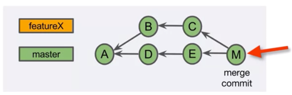

## Git’s Graph Model
* Git uses a directed acyclic graph (DAG) to represent commit history
  * git log --oneline  --graph
* Commits point to their parent commits

## Git IDs
* Git object names are also known as Git IDs
* Git objects are named with SHA-1 values
* SHA-1 values are unique for a given piece of content (statistically speaking)
* Git IDs are often shortened to the first four or more characters
* Use `git hash-object <file>` to create a SHA-1 for any content 
* `git show <shortened Git ID>` to identify an object

## Git Reference
* Reference is user-friendly name that points to 
  * A commit SHA-1 hash
  * Another reference
    * Known as symbolic reference
*	`~` refers to a prior commit
  *  `~` or `~1` == parent
  *	 `~2` or `~~` == parent’s parent
*	`^` refers to a parent in a merge commit (^parentnum)
  *  `^` or `^1` == first parent of the commit
  * `^2` == second parent of a merge commit
  *	`^^` == first parent’s first parent
*	HEAD is a reference that points to the current commit
    * `git show HEAD`
* Tag is a reference/label attached to a specific commit

 
  * Lightweight tag: a simple reference to a commit
  * Annotated tag:
    * A full Git object that reference a commit
    * Include tag author information, tag date, tag message, the commit ID
    * Optionally can be signed and verified with GNU Privacy Guard (GPG)
* `git tag` – view all tags in the repository
*	`git show <tag>` - show information associated with the tag
*	To tag a commit with a lightweight tag:
    *  `git tag <tagname> [<commit>]`
    * `<commit>` defaults to `HEAD`
*	To tag a commit with an annotated tag:
    *	`git tag -a [-m <msg> | -F <file>] <tagname> [<commit>]` 
    *	`<commit>` defaults to HEAD 
*	`git push` does not automatically transfer tags to the remote repository
*	To transfer a single tag:
    *	 `git push <remote> <tagname>`
*	To transfer all of your tags:
    *	`git push <remote> --tags`

## Git branches

*	A branch is the set of commits that trace back to the project’s first commit
    *	Brach master: A, B
    *	Brach feature X: A, B, C
*	A branch can have two types:
    * Topic
      * A feature, a bug fix, a hotfix, a configuration change, etc.
    *	Long-lived
        *  Master, develop, release, etc.
*	`git branch` – see a list of branches in the local repository, the branch with a * is the branch that you are currently on
*	`git branch <name>` - create a branch, that only creates a branch label
*	`git checkout <branch-or-commit>` - check out a branch or a commit (to switch to a branch)
    * `git checkout -b <branchname>` - the -b option combines git branch and git checkout, but only for new branches
*	Detached HEAD:
    *	The HEAD reference is detached from a branch label 

*	Delete a branch
    *	`git branch -d <branch>`
    *	`git branch -D <branch>`
*	Dangling commits
    *	Commits that do not belong to any branch (usually because of the delete of a branch label)

    *	Undo an accidental branch delete: git reflog - return a local list of recent HEAD commits

**REVIEW**
A branch is a set of commits that trace back to the project's first commit. 
Creating a branch creates a branch label. 
Checkout involves updating the HEAD reference and updating the working tree. 
A detached HEAD reference points directly to a commit. 
Fix a detached HEAD by creating a branch. 
Deleting a branch deletes a branch label. 
Dangling commits will eventually be garbage collected.

## Merging

*	Merge types:
    *	Fast-forward merge
    *	Merge commit
    *	Squash merge*
    *	Rebase*

*	Fast-forward (FF) Merge 
    *	Fast-forward merge is possible if no other commits have been made to the base branch since branching
    *	Performing an FF merge
        *	`git checkout master`
        *	`git merge featureX`
    *	attempting an FF is default
        *	`git branch -d featureX`

*	Merge commit
    *	Combines the commits at the tips of merged branches
    *	Places the result in the merge commit

    *	Performing a merge commit
      *	`git checkout master`
      *	`git merge featureX` 
        *	accept or modify the merge message
        *	optionally you can use git merge --no-ff featureX to always perform non-FF merge
      * `git branch -d featureX`

